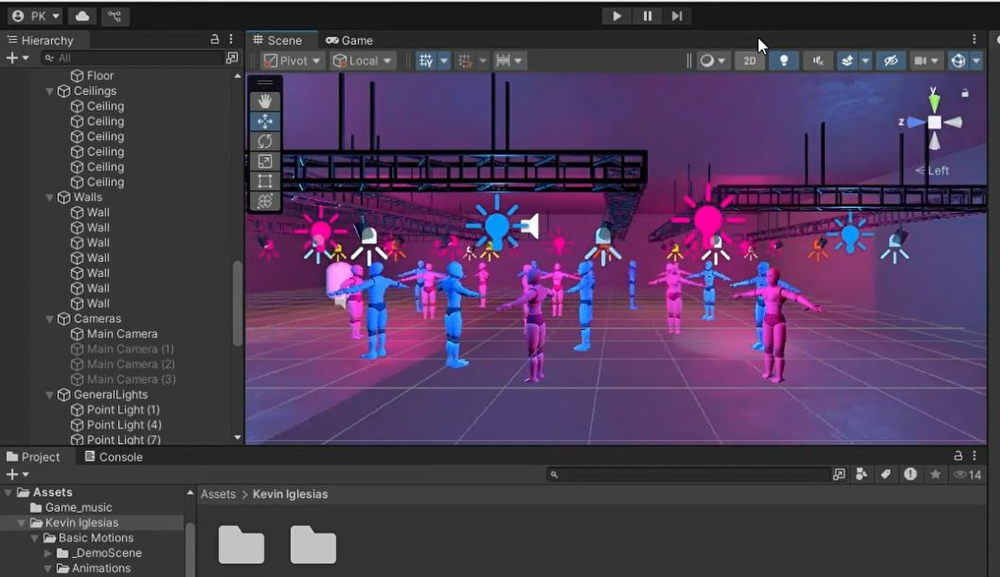
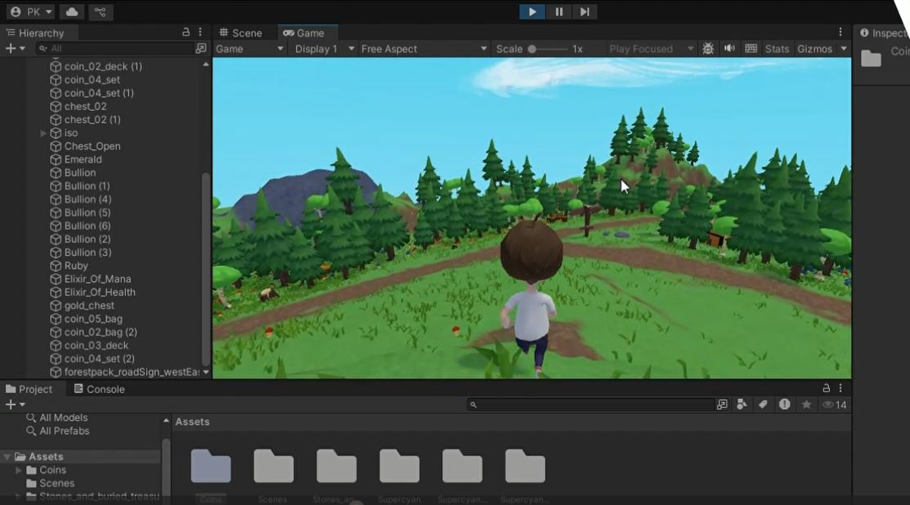

# unity-immersive-experiences

**Project Title:** 
Immersive Experiences in Unity.

**Description:**
A collection of immersive 3D environments and interactive applications built in Unity for gaming, educational tools, and simulations. The focus was on performance and user experience.

**Technologies:** Unity, C#.

**Dance Floor**

**Treasure Hunt**

